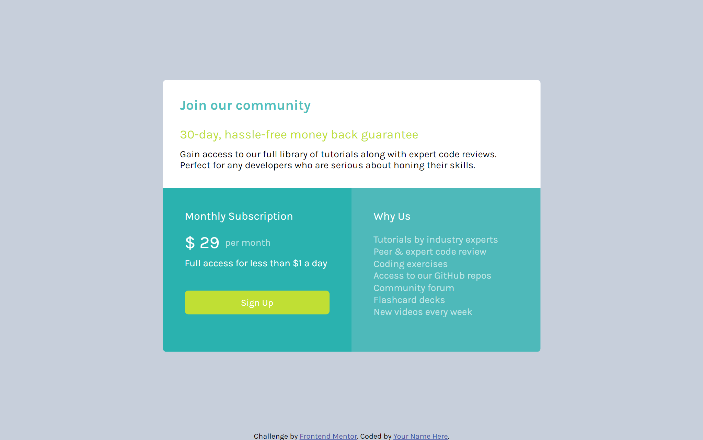

# Frontend Mentor - Single price grid component solution

This is a solution to the [Single price grid component challenge on Frontend Mentor](https://www.frontendmentor.io/challenges/single-price-grid-component-5ce41129d0ff452fec5abbbc). Frontend Mentor challenges help you improve your coding skills by building realistic projects. 

## Table of contents

- [Overview](#overview)
  - [The challenge](#the-challenge)
  - [Screenshot](#screenshot)
  - [Links](#links)
- [My process](#my-process)
  - [Built with](#built-with)
  - [What I learned](#what-i-learned)
  - [Continued development](#continued-development)
  - [Useful resources](#useful-resources)
- [Author](#author)
- [Acknowledgments](#acknowledgments)

**Note: Delete this note and update the table of contents based on what sections you keep.**

## Overview

### The challenge

Users should be able to:

- View the optimal layout for the component depending on their device's screen size
- See a hover state on desktop for the Sign Up call-to-action

### Screenshot

.png)

### Links

- Solution URL: [get answer](https://github.com/CHARLIEADITYA/single-price-grid-component-master.git)
- Live Site URL: [view](https://charlieaditya.github.io/single-price-grid-component-master/)

## My process

### Built with

- Semantic HTML5 markup
- CSS custom properties
- Flexbox
- [Styled Components](https://styled-components.com/) - For styles

### What I learned
Here I learned basic html css and learn a media query and increase my knowledge.

## Author

- Website - [github](https://github.com/CHARLIEADITYA)
- Frontend Mentor - [@CHARLIEADITYA](https://www.frontendmentor.io/profile/yourusername)
- Linkedin - [Aditya Baranwal](https://www.linkedin.com/in/aditya-baranwal-805978224/)

